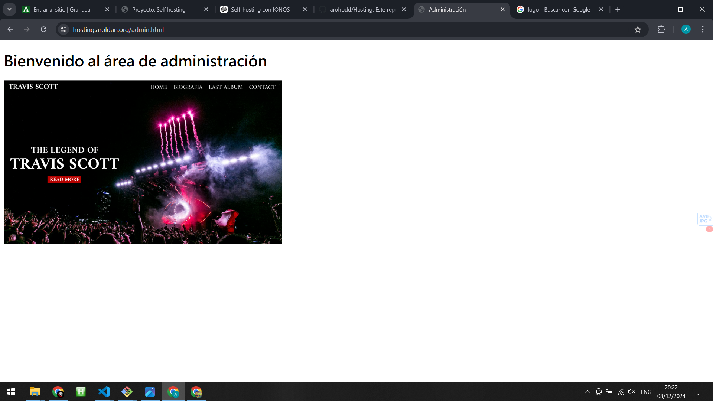

# Hosting

## Configuración del dominio

1. Compramos un dominio en IONOS (adjunto foto del menu de IONOS con el dominio ya comprado)


2. Configuramos la ApiKey de IONOS

  - Menu de configuración de la ApiKey


  - Creaos la nueva ApiKey


  - Le ponemos un nombre a la nueva ApiKey


  - Registro de la nueva ApiKey ya creada


3. Configuramos el Dynamic Dns de IONOS

  - Autorización de DNS con la ApiKey


  - Activando dynamic DNS


  - Respuesta de la request de activación de dynamic DNS con la url para actualizar la Ip asociada a nuestro dominio


4. Configuración de la tarea automática para actualizar la ip asociada a nuestro dominio

  - Creamos una nueva tarea en el programador de tareas de windows

    - Selecionamos el horario de repetición de la tarea en el desencadenador de la tarea


    - En la acción de la tarea agregamos como argumento la url de la respuesta de la request de activación de dynamic DNS con la url para actualizar la Ip asociada a nuestro dominio


  - Foto de la tarea ya configurada


5. Configuración del reenvio de puertos en nuestro Router

  - Accederemos al panel de control de nuestro router con la ip de enlace de internet y la clave del wifi si no lo has cambiado anteriormente

  - En la sección de configuración avanzada, en la sección de redireccionamiento de puertos de la interfaz de administración de red añadiremos dos nuevas redirecciones, el puerto 80 y el puerto 443 (Tienen que apuntar a la ip de nuestro servidor web)


6. Probamos quwe se vea el dominio en internet con una pagina de prueba


## Configuración del servidor web

1. Lo primero que tenemos que hacer es en la carpeta que hayamos creado para la práctica, hacer 'vagrant init' para iniciar vagrnat y la configuración de nuestro servidor web

2. Una vez iniciado vagrant tenemos que configurar el archivo vagrantFile para que vagrant pueda iniciar nuestro servidor web

  - Esta seria la configuración que tenemos que hacer en el archivo vagrantFile explicado en detalle a continuación

  ```ruby
    Vagrant.configure("2") do |config|
      #Sistema operativo que vamos a utilizar
      config.vm.box = "debian/bookworm64"

      config.vm.define "vb" do |vb|

        #Configuramos la red de nuestro servidor, la hacemos publica para que podamos acceder a nuestro servidor desde el exterior
        vb.vm.network "forwarded_port", guest: 80, host: 8080
        vb.vm.network "public_network", ip: "192.168.210.100"

        vb.vm.provision "shell", inline: <<-SHELL
        #Instalamos Apache2 y UFW para permitir el acceso a nuestro servidor y crearlo
          sudo apt update
          sudo apt install -y apache2
          sudo apt install ufw

          #Permitimos el acceso a nuestro servidor por los puertos 80 y 443
          sudo ufw allow 80/tcp
          sudo ufw allow 443/tcp


          # Iniciar Apache
          sudo systemctl start apache2
          sudo systemctl enable apache2

          # Crear directorios y copiar los archivos del proyecto
          sudo mkdir -p /var/www/webHosting/html
          sudo cp -r /vagrant/web/ /var/www/webHosting/html
          sudo chown -R www-data:www-data /var/www/webHosting/html/web
          sudo chmod -R 755 /var/www/webHosting/html 

          #Creamos el archivo de autenticación para el admin y el sysadmin que vamos a utilizar el las rutas /status y /admin
          sudo htpasswd -cb /etc/apache2/.htpasswd admin asir
          sudo htpasswd -b /etc/apache2/.htpasswd sysadmin risa 

          #Copiamos los certificados y la clave privada para el certificado SSL
          sudo cp /vagrant/_.aroldan.org_private_key.key /etc/ssl/private/webHosting.org.key
          sudo cp /vagrant/aroldan.org_ssl_certificate.cer /etc/ssl/certs/webHosting.org.cer
          #Damos los permisos para que el usuario root pueda acceder a los archivos
          sudo chmod 600 /etc/ssl/private/webHosting.org.key
          sudo chown root:root /etc/ssl/private/webHosting.org.key


          # Copiar archivos de configuración de Apache
          cp /vagrant/default-ssl.conf /etc/apache2/sites-available/default-ssl.conf
          cp /vagrant/000-default.conf /etc/apache2/sites-available/000-default.conf

          cp /vagrant/apache2.conf /etc/apache2/apache2.conf

          # Habilitar sitios y módulos SSL
          sudo a2ensite 000-default.conf
          sudo a2ensite default-ssl.conf
          sudo a2enmod auth_basic
          sudo a2enmod headers
          sudo a2enmod ssl
          #Reiniciamos apache2 para que se apliquen los cambios
          sudo systemctl restart apache2
        SHELL
      end
    end
  ```


3. Ahora que tenemos el archivo vagrantFile configurado nos podemos centrar en configurar los archivos necesarios para que el servidor web funcione correctamente

  - Vamos a necesitar los archivos para el certificado, y vamos a descargalos de IONOS ya que hemos comprado el dominio, descargamos los archivos respectivos para los certificados que en este caso serian los dos primeros


  - Me ha dado estos archivos que los he copiado a la maquina mediante cp en la ruta que deben de ir con el nombre oportuno


  - Cuando tenemos los archivos del certificado configuraremos los archivos de apache para configurar tanto http y https con los certificados y la configuración necesaria del servidor
  
  ```ruby
    # Configuramos para todas las ip que intenten entrar por el puerto 443
    <VirtualHost *:443>
      
      #Permitimos ssl para la configuración y les decimos donde va a estar el certificado, aclarar que hemos copiado en el archivo vagrantFile los certificados que nos ha dado IONOS a esta ruta
      SSLEngine on
      SSLCertificateFile /etc/ssl/certs/webHosting.org.cer
      SSLCertificateKeyFile /etc/ssl/private/webHosting.org.key

      #le indicamos el origen de la ruta donde esta en index.html y el nombre del dominio
      DocumentRoot /var/www/webHosting/html/web
      ServerName hosting.aroldan.org

      #le indicamos que si hay un error en la pagina 404 lo redirija a la pagina de error que hemos creado
      ErrorDocument 404 /404.html

      <Directory /var/www/webHosting/html>
          Options FollowSymLinks
          AllowOverride All
      </Directory>

      #Redirigimos /admin a /admin.html para ir a la pagina que hemos creado para el admin
      redirect /admin /admin.html

      #Aqui le indicamos que es una área restringida y que vamos a pedir autentificación
      <Location /admin.html>
          AuthType Basic
          AuthName "Restricted Area"
          AuthUserFile /etc/apache2/.htpasswd
          Require valid-user
      </Location>

      #Aquí hacemos lo mismo para la ruta /status que vamos a mostrar la información del servidor
      <Location /status>
          SetHandler server-status
          AuthType Basic
          AuthName "Restricted Area"
          AuthUserFile /etc/apache2/.htpasswd
          Require valid-user
      </Location>

      ErrorLog ${APACHE_LOG_DIR}/error.log
      CustomLog ${APACHE_LOG_DIR}/access.log combined
    </VirtualHost>
  ```


  - Ahora voy a mostrar los archivos web que he creado para configurar el sitio
    
    - Primero voy a mostrar la carpeta con todos los archivos web

    
    - El archivo index seria este, es sencillo pero es lo necesario para comprobar que funciona

    ```html
      <!DOCTYPE html>
      <html lang="es">
      <head>
          <meta charset="UTF-8">
          <meta name="viewport" content="width=device-width, initial-scale=1.0">
          <title>Welcome</title>
          <style>
              body {
                  font-family: Arial, sans-serif;
                  text-align: center;
                  padding: 50px;
              }
              h1 {
                  color: #007BFF;
              }
          </style>
      </head>
      <body>
          <h1>Welcome to the Web Hosting Server!</h1>
          <p>This is the home page of hosting.aroldan.org</p>
      </body>
      </html>
    ```

    -Adjunto foto de la página en la web con el certificado funcionando


    - El archivo de admin seria este, incluye un titulo y una foto

    ```html
    <!DOCTYPE html>
    <html lang="es">
    <head>
        <meta charset="UTF-8">
        <meta http-equiv="X-UA-Compatible" content="IE=edge">
        <meta name="viewport" content="width=device-width, initial-scale=1.0">
        <title>Administración</title>
    </head>
    <body>
        <h1>Bienvenido al área de administración</h1>
        
    </body>
    </html>
    ```

    -Adjunto foto de la página en la web
      - Prueba de que pide autenticación


      - Autentificación correcta



    - Esta es la pagina para el error 404

    ```html
    <!DOCTYPE html>
      <html lang="es">
      <head>
          <meta charset="UTF-8">
          <meta name="viewport" content="width=device-width, initial-scale=1.0">
          <title>404 - Page Not Found</title>
          <style>
              body {
                  font-family: Arial, sans-serif;
                  text-align: center;
                  padding: 50px;
                  background-color: #f8d7da;
                  color: #721c24;
              }
              h1 {
                  font-size: 50px;
              }
          </style>
      </head>
      <body>
          <h1>404</h1>
          <p>The page you're looking for doesn't exist.</p>
          <p><a href="/">Go Back to Home</a></p>
      </body>
      </html>
    ```
    - Página de error 404 en la web


    - Página de la ruta /status con la información del servidor
      - Prueba de que pide autenticación


      - Autentificación correcta


    - Y por último para que se descargue el logo he creado este archivo para forzar que al entrar en la ruta /logo.png se descargue el logo


      - Prueba de que se descarga el logo


### Y esta seria la configuración para tener un servidor web creado con apache2 y vinculado al dominio hosting.aroldan.org